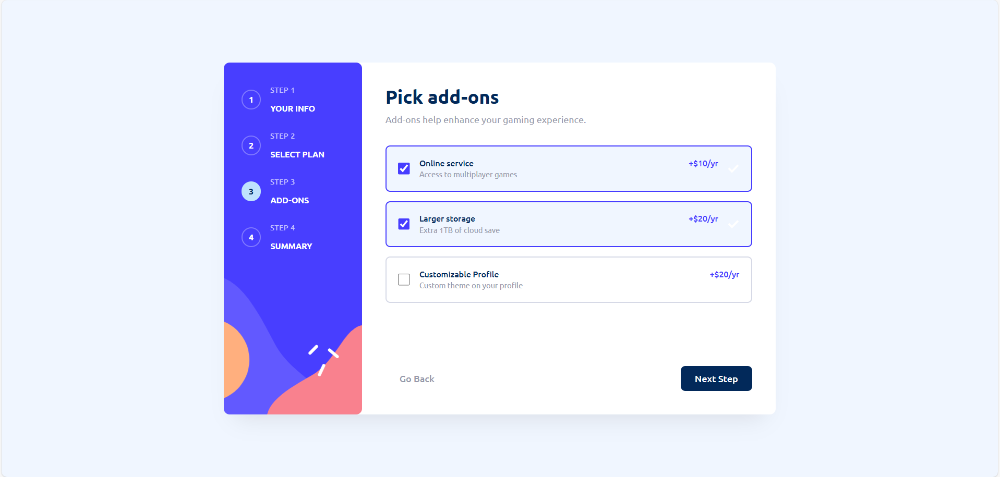
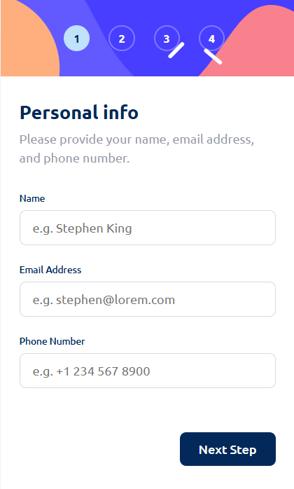

# Multi-Step Form







A modern, responsive multi-step form for gaming platform subscription management.

## Features

- **5-Step Process**
  - Personal Information (Name, Email, Phone)
  - Plan Selection (Arcade, Advanced, Pro)
  - Add-ons Selection (Online Service, Storage, Profile Customization)
  - Order Summary & Review
  - Confirmation

- **Billing Options**
  - Monthly or Yearly billing toggle
  - Dynamic pricing updates based on billing cycle

- **Form Validation**
  - Name validation
  - Email format validation
  - Phone number validation
  - Error messages for invalid inputs

- **User Experience**
  - Step navigation with back/next buttons
  - Direct step access via side indicators
  - Data persistence when navigating between steps
  - Responsive design (desktop and mobile)
  - Smooth transitions and hover states

## Getting Started

1. Open `index.html` in your web browser
2. Fill out the form step by step
3. Review your selections on the summary step
4. Confirm your subscription

## File Structure

```
multi-step-form/
├── index.html          # HTML structure
├── style.css           # Styling
├── script.js           # Form logic and validation
├── README.md           # This file
└── multi-step-assets/  # Design reference and assets
    ├── assets/         # Images and fonts
    └── design/         # Design mockups
```

## Technologies Used

- HTML5
- CSS3
- Vanilla JavaScript
- Ubuntu Font (Google Fonts)

## Colors Used

- Marine Blue: `hsl(213, 96%, 18%)`
- Purplish Blue: `hsl(243, 100%, 62%)`
- Pastel Blue: `hsl(228, 100%, 84%)`
- Strawberry Red: `hsl(354, 84%, 57%)`
- Cool Gray: `hsl(231, 11%, 63%)`

## Browser Support

Works on all modern browsers that support ES6 JavaScript and CSS Grid/Flexbox.
